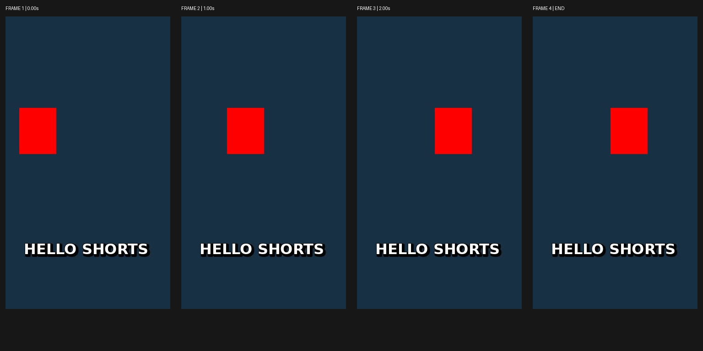

# Public-repository installation and use test

Tested on 2026-09-10 with a **fresh clone of the public GitHub repository**, not the development checkout. Code commit: [`a807025`](https://github.com/JangHyuckYun/shorts-scope/commit/a80702567aa73af8bef42adcf4e95bd6f4f1e4f4). Later documentation commits attach these results; the tested runtime/skill bundle is unchanged.

## What actually ran

1. `git clone https://github.com/JangHyuckYun/shorts-scope.git` into a previously absent, persistent user directory. Verified origin and commit.
2. Created a **new venv** and installed `requirements-compact.txt` from that clone. No copied development venv, model weights or optional evidence dependencies.
3. Ran the cloned `scripts/install_skill.py --host openclaw --workspace <actual-workspace>` dry-run, then installation. The workspace path resolves through a local symlink; both names refer to the same active workspace.
4. Queried the actual OpenClaw inventory: `source: openclaw-workspace`, `eligible: true`, `modelVisible: true`, `userInvocable: true`, `disabled: false`, both allowlist/agent filters unblocked. No allowlist or host configuration changes.
5. Read the installed skill instructions and ran **its installed launcher**, not `cli.py` in the development checkout. It extracted a generated 3-second reference, prepared an offline analysis request, and ran the optional authenticated Codex analysis backend.
6. Downloaded GitHub's generated source tarball for the tested commit. Confirmed it contains the required skill ZIP, installer, English/Korean READMEs and host guide. This also verifies removal of the old upstream export exclusions.

The demonstration used an original synthetic fixture from `examples/make_style_fixture.py` with a locally installed DejaVuSans-Bold font. No third-party reference video or font file is redistributed. The attached images are generated test outputs, not an edited screenshot of a claimed result.

## Artifacts you can inspect



- [Verification receipt and file SHA-256 hashes](examples/install-20260910/verification.json)
- [Executed commands, exit codes, timings and stdout/stderr](examples/install-20260910/commands.json)
- [Actual analysis JSON](examples/install-20260910/analysis.json)
- [Readable model report](examples/install-20260910/report.md)
- [Extraction manifest](examples/install-20260910/manifest.json), with the individual frames and endpoint in the same directory
- [Fixture source truth](examples/install-20260910/expected.json)

The command record is captured subprocess output, with local directory prefixes replaced by `<REPO>`, `<WORKSPACE>`, `<SKILL>` and `<ARTIFACTS>`. Relative commands ran from the fresh clone. Only the cloned source and documented runtime were used; the installer artifact was not silently repaired for this test. Raw model observations are retained, including errors. Other private runtime/provider logs and credentials are not published.

The extraction bundle is reusable, for example from this repository root:

```sh
.venv/bin/python cli.py analyze docs/examples/install-20260910/manifest.json \
  --out output/public-example-request
```

This prepares another request locally; it does not charge for or call a model. The published `analysis.json` is a final wrapper; importing a new model response requires raw schema-matching JSON, as described in the analysis guide.

## Actual result and errors

- **4 images:** 0.00s, 1.00s, 2.00s and END. Extraction internal time **0.414s**; installed-launcher wall time about 0.600s.
- Offline analysis preparation succeeded without a model call.
- Live `gpt-5.6-luna`, requested `low`: **55.82s**, provider-reported input 19,011 / output 2,598 tokens, including harness context.
- `HELLO SHORTS` transcribed correctly in **4/4** images. White/bold appearance, black outline and lower-right shadow were described.
- Estimated red-object boxes versus known source geometry: IoU **0.9834, 0.9844, 0.9844, 0.9844**. The last sample repeats the last source state. This simple solid-shape fixture is not a real-world detector benchmark.
- Rightward position changes and the unchanged final position were described.
- **Errors remain:** the non-square rectangle was called a square; the graphic title was classified as `subtitle`; some wording suggested continuous movement that sparse/discrete source samples do not establish. These results do not prove exact semantic or action accuracy.

This verifies actual OpenClaw inventory recognition and installed CLI usage, **not every Codex/Claude/Grok interactive host**, nor a fresh conversation's automatic skill selection. The per-host installer layouts retain their offline tests. Grok web still has no verified native local skill registry. The broader 109-test suite passed after the distribution cleanup; a test count is not a model-accuracy score.
